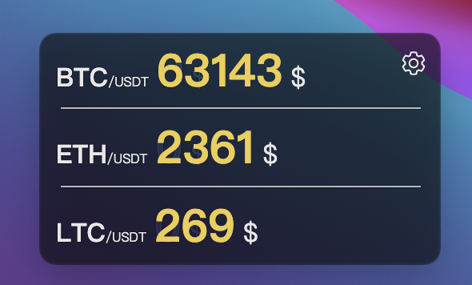
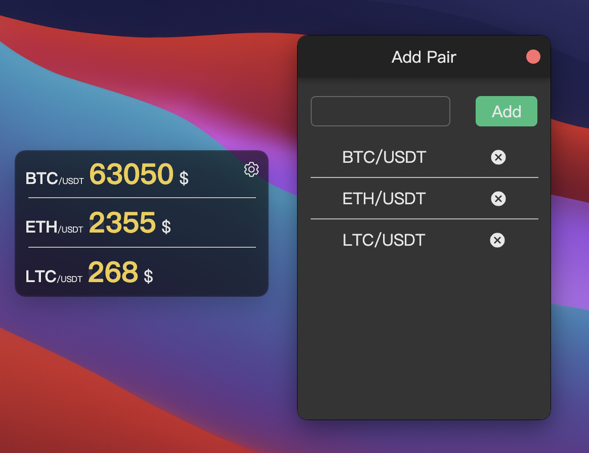
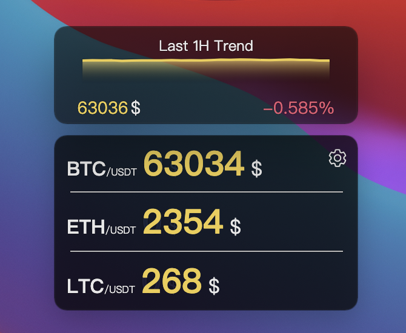

# Digital currency monitor

Pure digital currency monitor

## Starting Development

```shell
git clone https://github.com/cernard/Digital-currency-monitor.git
cd Digital-currency-monitor
yarn
yarn start
```

## Packaging

```shell
yarn package
```

## Preview:

### Suspension monitor



### Config

Click the setting button on the right corner of the suspension monitor can show the config window.



### Last 24 hour trend

The trend window will be shown when the mouse moves over the suspension monitor.



## Some hards for me :broken_heart:

I'm new to electron...I can't generate a normal installation package... :sob:
If you are familiar with electron and react, help me please. :joy:
